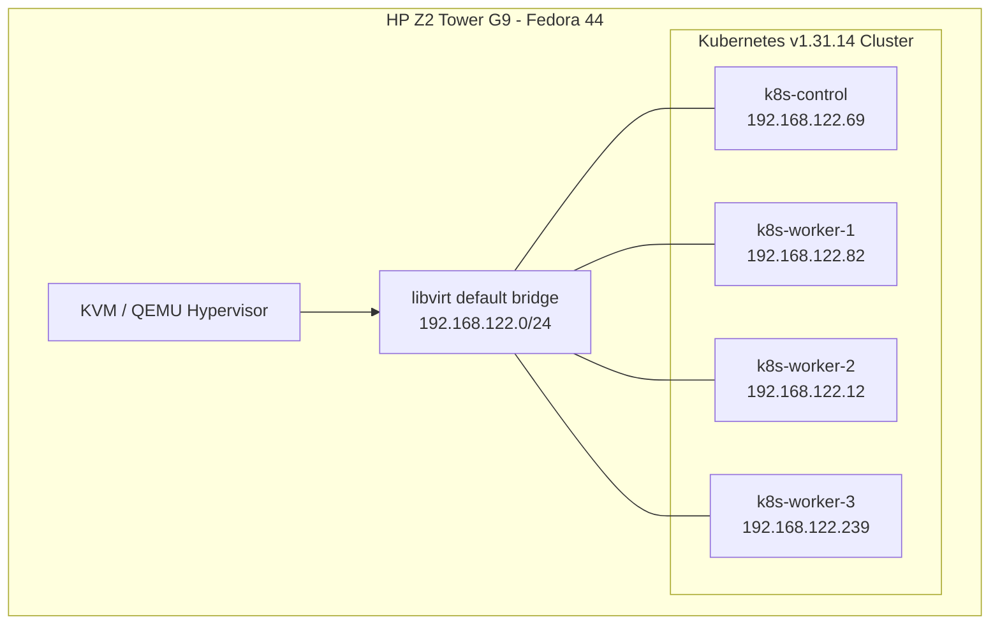

# Bare-Metal Kubernetes Cluster via KVM/QEMU

A 4-node Kubernetes cluster provisioned locally on Fedora 44 using KVM/QEMU, libvirt, and Rocky Linux 9.

## Architecture



## Stack

- **Hypervisor:** KVM/QEMU + libvirt
- **OS:** Rocky Linux 9.8 (GenericCloud image)
- **Container Runtime:** containerd 2.2.6
- **Orchestrator:** Kubernetes v1.31.14 (kubeadm)
- **CNI:** Flannel (VXLAN)

## Docs

- [Full setup guide](./k8s-kvm-setup-guide.md) — step by step provisioning, bootstrap, and troubleshooting
- [Known issues & fixes](./troubleshooting.md) — production-readiness gaps found post-deployment

## Quick Start

```bash
sudo virsh start k8s-control k8s-worker-1 k8s-worker-2 k8s-worker-3
sudo virsh net-dhcp-leases default
ssh admin@<control-plane-ip>
kubectl get nodes
```
